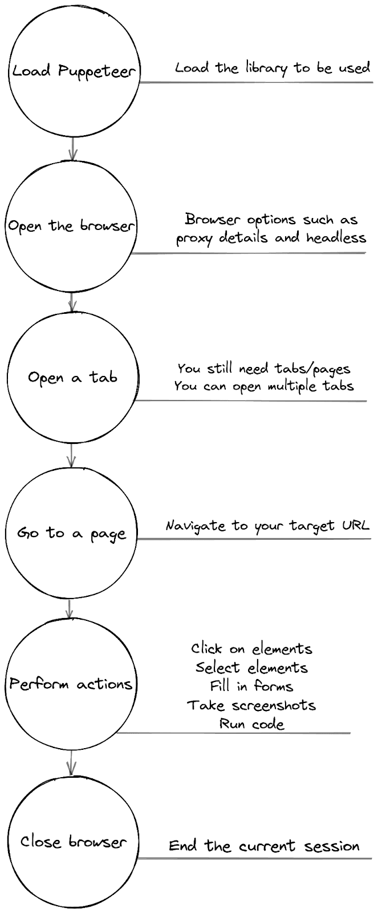

# Web Scraping With JavaScript and Node.js Without Getting Blocked


Web scraping with JavaScript and Node.js is a great idea. It allows you to collect data from sites even if they rely on modern practices such as dynamically loading page components.

Scraping in itself has many upsides. You can monitor competition prices, suppliers, automate tasks, and check brand mentions. Web scraping allows you to automate data collection and turn it into useful insights for your business.

If you execute web scraping with JavaScript, you get all the flexibility of mimicking a real user, with the simplicity of using automation, pre-made libraries, and code snippets.

But there are a few important points to consider.

The first and more critical point in web scraping is to avoid getting blocked. Web scraping is perfectly legal, but most sites try to block it.

Another essential factor is to use tools that are fast and reliable. There are many options to pick from, and it’s confusing to make a choice when you are just getting started on web scraping with JavaScript and Node.js.

Therefore, our goal for today is to provide a simple and complete guide on web scraping with JavaScript and Node.js. In addition, you are going to learn how to avoid getting blocked and how to perform any action on a page, such as clicks, logins, taking screenshots, and more.

Let’s get started!

## How to Perform Web Scraping With JavaScript and Node.js?

You can leverage web scraping capabilities with JavaScript by utilizing Node.js development services.

JavaScript is a programming language originally processed in the browser only when pages are loaded. But you can use Node.js to run JS code on the server side.

Then you can create a browser instance via code to load pages and extract data.

Libraries such as Puppeteer, Chromeless, PhantomJS, and Playwright allow you to create and interact with headless browsers. These browsers are controlled by code, allowing you to perform actions such as clicking buttons, filling in forms, taking screenshots, and getting data.

Each library has its pros and cons, and usually, it’s a trade-off between complexity and flexibility. Thus, easier-to-use libraries often don’t have as many features.

## Is Node.js Good for Web Scraping?

Node.js is an excellent tool for web scraping. It allows you to programmatically load sites, render the page, perform actions and extract data.

You can use libraries such as Puppeteer to make this process easier.

## How to Pick the Right JavaScript Scraping Library

There are many options to scrape pages using JavaScript. However, there are four main paths for doing it:

1. **Fetch the web page and use regular expressions to read HTML code** - This might seem like the simplest option, but it is just too limited. Many things can break this approach, from dynamic pages to broken HTML structures.
2. **Fetch the web page and use a parser** - These parsers, such as JSDom, Cheerio, and node-as-browser, create a fake DOM environment. It’s better than regular expressions but still very limited for real-life scraping.
3. **Load the XHR requests** - If you are very lucky, you might have the option to just load the XHR data directly. Go to developer tools > network. Check the XHR responses and see if any of them contain the data you need. If you are lucky, then your data is there. Accordingly, you can connect to it using proxies or even a headless browser (just like #4, but parsing the output as JSON instead of HTML).
4. **Use a headless browser** - This one is the most complete and flexible way to perform web scraping with JavaScript. It is essentially automating the task of opening a web browser and performing actions like a human would do, but with code.

That being said, in this tutorial, we will focus on headless browsers. In particular, Puppeteer, which is a library with pre-made functions to create headless browser instances and interact with them.

There are many other libraries like Puppeteer, and they all work similarly. So even if you pick a different library, the code logic is similar to what we describe here. You’ll just need a few adjustments to find the right syntax.

## A Visual Guide to JavaScript Web Scraping

If you want to perform JavaScript web scraping, there is a simple process to follow. Each step in this process translates to a command or code snippet.

However, it’s important to remember that most steps depend on the execution of the previous step. For instance, you can only load a page once the browser tab is open. Thus, you need to take this into account in your code.



This entire workflow can be summarized in 4 steps:

1. **Load Node.js and Puppeteer** - loading the base structure based on triggers;
2. **Fetch the target page** - open the browser (with a proxy);
3. **Perform actions** - click, fill in forms, take screenshots, run code, get data;
4. **Process & save your data somewhere, close the browser**.

Now let’s see what happens at each step of your JavaScript web scraping workflow.

### Step 1 - Load Node.js for Web Scraping With Puppeteer

If you haven’t already, install Node.js on your computer or server. Once it is installed, you can install libraries and create projects in folders. Thus, if you run a command such as “node scraper.js”, it uses Node.js to parse the scraper.js file in your current folder.

For this reason, make sure that you have your libraries installed correctly in your folders.

Run the command “npm install puppeteer” in your terminal and this should install the Puppeteer library under /node_modules. You are ready to scrape now!

Let’s start with this code:

```javascript
const puppeteer = require("puppeteer");
```

This line loads the Puppeteer library.

Then, you need to think about how you will run your scraping tasks.

Right now, we are taking a simple approach - we just run it from the terminal. In the future, you can load URLs from a list, from a database, or even run Puppeteer as a service/API on your server to make the most out of your scraper.

After the library is loaded, add this code to your scraper.js file:

```javascript
var url = process.argv[2];
if (!url) {
   url = "https://www.reddit.com/";
}
```

This loads the third argument from the command prompt as the target URL from the process.argv array.

Then the “if” command assigns a default URL in case there is no URL defined in the terminal. So if you run this:

```bash
node scraper.js
```

The URL is reddit.com. And if you run this:

```bash
node scraper.js https://github.com
```

The URL is github.com. Then you can create a function to contain all the scraping tasks. For now let’s just use this:

```javascript
async function scrape() {
   console.log("Puppeteer is ready");
}
scrape();
```

### Step 2 - Fetch the Target Page and Extract Data From It

From now on, everything you do is inside the scrape() function. You can start Puppeteer now and save the current browser instance in a variable like this:

```javascript
const browser = await puppet;

eer.launch();
```

However, there’s a problem. If you just use this code, you will get blocked really fast.

The hosting provider will notice very quickly that the same IP is performing the same actions every time you scrape a page there.

Thus, you need to use proxies to stay under the radar.

#### How to Use Authenticated Proxies With Puppeteer

Developers use many techniques to separate real traffic from scraping bots.

One thing they do is check how fast and how often a specific visitor returns. If you can read a large number of pages every second or if you visit their site every day at the exact same time, they will be suspicious.

The easiest way to safely scrape pages undetected is to use IPRoyal’s residential proxies service. With it, you can load sites from residential IP addresses and use a different IP each time. Thus, there’s no way for developers to know that you are visiting their pages multiple times. For all they know, these are different visits from different users.

After you have signed up for IPRoyal, you’ll set up your proxy username and password. You can see them in your dashboard as well:


Now you just need to pass this information to Puppeteer.

So, instead of the simple launch() function, you can use it like this:

```javascript
const browser = await puppeteer.launch({
   args: ["--proxy-server=http://geo.iproyal.com:22323"],
});
const page = await browser.newPage();

await page.authenticate({
   username: "yourusername",
   password: "yourpassword",
});
await page.goto(url);
await page.screenshot({ path: "screenshot.png" });
browser.close();
```

When I visit https://ipv4.icanhazip.com/ using the browser I see this information as my IP:


And if I run “node scraper.js https://ipv4.icanhazip.com”, this is what I see on the screenshot.png file:


Notice how even the color scheme is different because I use a dark theme in my regular browser.

Now that the proxy is working, we are ready to scrape data.

### Step 3 - Interact With Your Target Page

You can do many things with Puppeteer. Anything a human can do, you can do as well (yes, even solving CAPTCHAs).

Here is a list of all the things we are going to explore in this section:

-  How to target an element and load data,
-  How to interact with the page via clicks, form submissions,
-  How to take screenshots,
-  How to do anything else.

Let’s go over each of these points.

#### How to Target an Element and Extract Data Using Puppeteer

There are a few ways to target elements with Puppeteer. But a quick and easy way to do it is to use CSS selectors.

Let’s scrape Reddit’s homepage. If you want to get the upvotes count for the first item, you can use this code:

```javascript
var count = await page.$(
   "#t3_xgifgu > div:nth-child(2) > div:nth-child(1) > div:nth-child(2)"
);
```

The magic here lies in using the $ method on the Puppeteer’s tab to load an element using CSS code.

If you don’t know the exact selector for an item, you can use the browser inspector, then right-click an element, and you’ll see the option to copy the CSS selector like this:


Another option is to copy the XPath, then use a tool such as CSSify to turn XPath into CSS code.

Then you can extract the text from that element. Here is how you can do it:

```javascript
count = await count.evaluate((el) => el.textContent);
console.log("Upvotes count is " + count);
```

If you run your scraper file with this code, you should see something like this:

```
The upvotes count is 28.5k
```

Thus, the upvote count is saved on the count variable. You can manipulate this data, save it to your database or even use it for other scraping tasks.

#### How to Perform User Actions with Puppeteer

One of the best perks of web scraping with JavaScript and Node.js is performing actions you usually do when visiting a site. Anything you can usually do in a browser, you can do with Puppeteer.

You can click buttons, fill in forms, scroll, and even perform specific actions, such as moving the mouse cursor to a position or pressing a keyboard key.

For example, you can click on one of Reddit’s links using this code:

```javascript
const button = await page.$(
   "html > body > div:nth-of-type(1) > div > div:nth-of-type(2) > div:nth-of-type(2) > div > div > div > div:nth-of-type(2) > div:nth-of-type(2) > div:nth-of-type(2) > div > div:nth-of-type(1) > div > ol > li:nth-of-type(1) > a"
);
await button.evaluate((b) => b.click());
```

The logic behind the click action is the same as the text extraction. First, you store the element you want to manipulate in a variable. Then you use the evaluate command to perform actions.

Here are some other methods for you to play with:

-  `page.type(CSS SELECTOR, CONTENT)` - target a form element and type into it;
-  `page.focus(CSS SELECTOR)` - select a form element;
-  `page.keyboard.type(CONTENT, { delay: 100 })` - types using the keyboard;
-  `page.mouse` - from moving the mouse to emulating drag and drop;
-  `page.waitForSelector` - wait for an element to be loaded;
-  `page.evaluate()` - run any JS code you want, which allows you to perform any other action such as scroll (window.scroll), complex page interactions, and pre-process data.

#### How to Take Screenshots Using Puppeteer

In addition to interacting with pages, you can use JavaScript, Node.js, and Puppeteer to take screenshots and save pages as PDFs. You can screenshot the currently visible portion, the entire page, mimic a device or even screenshot specific elements.

You can take a screenshot with the .screeshot() method:

```javascript
await page.screenshot({ path: "screenshot.png" });
```

Don’t forget to define a filename. In our example, it’s screenshot.png. This function completely overwrites any other files with the same name. So make sure it isn’t already in use.

The default screen size in Puppeteer is 800x600 pixels. Thus, that’s the default screenshot size. You can change it using the .setViewport() method:

```javascript
await page.setViewport({ width: 1280, height: 1024 });
await page.screenshot({ path: "screenshot.png" });
```

In this case, the viewport change is applied after the page is loaded. However, some sites don’t handle viewport resizing so well, so you might want to change the viewport before loading the page.

The screenshot method has some options, such as taking full-page screenshots as opposed to just a screenshot of the currently visible portion:

```javascript
await page.screenshot({
   path: "screenshot.png",

   fullPage: true,
});
```

Taking a screenshot of an element is as simple as passing the screenshot method to it. It’s just like what you did with the page, but with a specific element.

For example, you can take a screenshot of the Reddit’s header like this:

```javascript
const header = await page.$("header");
await header.screenshot({ path: "header.png" });
```

You can even pass specific dimensions to clip the screenshot.

Saving a page as a PDF is quite simple as well. You can do it with this command:

```javascript
await page.pdf({ path: "export.pdf" });
```

The export.pdf file contains that page along with links, images, and text.

### Step 4 - Process and Save the Extracted Data

Now it’s time to gather, process, and save all the information you need. The specific functions depend on what you are trying to do, but the previous code snippets should work as a good starting point.

Also, don’t forget to close the browser once you are done.

Here is a quick summary of all the code we have used so far, so you can copy and paste it while also adding your methods to save data.

```javascript
const puppeteer = require("puppeteer");
var url = process.argv[2];
if (!url) {
   url = "https://www.reddit.com/";
}
async function scrape() {
   console.log("Puppeteer is ready");

   //launch Puppeteer using a proxy
   const browser = await puppeteer.launch({
      args: ["--proxy-server=http://geo.iproyal.com:22323"],
   });
   const page = await browser.newPage();

   // proxy authentication
   await page.authenticate({
      username: "yourusername",
      password: "yourpassword",
   });

   // open a browser instance
   const browser = await puppeteer.launch();

   //open a new tab
   const page = await browser.newPage();

   //change screen size for a bigger screenshot
   await page.setViewport({ width: 1280, height: 1024 });

   //go to the target page
   await page.goto(url);

   //get the element with the highest upvotes count
   var count = await page.$(
      "#t3_xgifgu > div:nth-child(2) > div:nth-child(1) > div:nth-child(2)"
   );

   //extract the text from the count element
   count = await count.evaluate((el) => el.textContent);

   //display the upvotes count
   console.log("Upvotes count is " + count);

   //run any JS code you want
   await page.evaluate(() =>
      alert("Run any code you want on a page with evaluate")
   );

   //get a button
   const button = await page.$(
      "html > body > div:nth-of-type(1) > div >   div:nth-of-type(2) > div:nth-of-type(2) > div > div > div > div:nth-of-type(2) > div:nth-of-type(2) > div:nth-of-type(2) > div > div:nth-of-type(1) > div > ol > li:nth-of-type(1) > a"
   );

   //click the button element
   await button.evaluate((b) => b.click());

   // take a screenshot of the entire page (remove fullPage to save only the currently visible portion)
   await page.screenshot({
      path: "screenshot.png",
      fullPage: true,
   });

   //get the site's header element
   const header = await page.$("header");

   //take a screenshot of the header element only

   await header.screenshot({ path: "header.png" });

   //save the target page as a PDF
   await page.pdf({ path: "export.pdf" });

   // close the browser
   browser.close();
}
scrape();
```

## Final Thoughts

Today you learned how you can perform web scraping with JavaScript and Node.js. We went from the simple questions, such as picking the right tool, to the exact functions you can use to scrape pages without getting blocked.

You saw how you could use this knowledge not just to scrape pages but automate tasks by interacting with your target pages programmatically. We hope you enjoyed it, and see you again next time!

```

```
